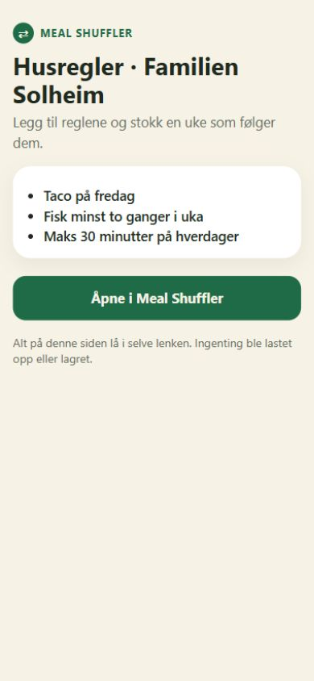
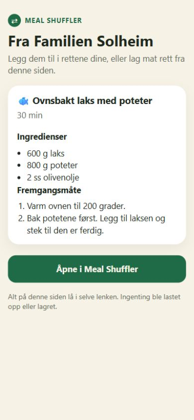

# Meal Shuffler — app review after the September improvements

29 September 2026 · reviewed working tree based on `d94d9d2`

## Verdict and scope

The product has a coherent core: rules shape a real week, individual choices survive shuffling, recipes feed a shopping list, and cooking/history close the loop. The shared artwork and adaptive palette make the source design more consistent. The new sharing and natural-language entry paths need another reliability pass before release, particularly ingredient exclusions and preservation of recipe data.

This is a broad **source and asset review**, plus a **live browser audit of the actual share-page renderer**. It is not a completed native visual audit or release sign-off. Windows has no Xcode/iOS simulator here: Swift compilation, the 219 discovered XCTest methods, native layouts, VoiceOver, device performance, notifications and iCloud integration could not be exercised. No old screenshots or generated mockups are used as evidence of the app running.

Skills used: Product Design Audit for evidence, flow and accessibility review; Redesign Existing Projects for the design-system checklist; Imagegen for the new logo. The audit skill's native screenshot requirement could not be met, so native conclusions are explicitly source-based. Existing uncommitted artwork/design work was preserved.

## Findings, in priority order

### 1. P1 — An unrestricted ingredient ban does not protect freezer/leftover meals

**Trigger:** enter “no peanuts” or “allergic to peanuts”, then plan a freezer batch containing an ingredient named “peanut”. The parser emits `maximumPerWeek(ingredient, 0)`. Weekly-maximum validation counts only freshly cooked `.meal` entries; freezer batches are `.leftovers`. The leftovers resolver checks `excludedOn`, not that zero-count rule. A matching freezer meal can therefore remain without an ingredient-ban conflict.

**Evidence:** `RuleSentenceParser.swift:111–115`; `MealPlanGenerator.swift:86–90, 312–325, 641–646, 683–693`. This is a traced source path, not an executed Swift reproduction.

**Fix:** represent an all-day ingredient exclusion with an all-day exclusion constraint, preserve any schedule, and test fresh meals, ordinary leftovers and freezer snapshots. Keep weekly category-count semantics distinct.

**Related trust issue:** `RuleComposer.swift:62` says allergies work, while `PlanningRule.swift:124–127` only performs a substring match on ingredient names. “Nut” does not match “almond”, and multilingual names need not match each other. The template builder already explains this limitation (`RulesView.swift:282`); the new composer does not. Use “ingredient exclusions” and show that limitation in its preview. This app does not implement allergen verification.

### 2. P2 — Adding a partially understood batch discards the rest of the sentence

**Trigger:** enter a new recognized rule followed by an incomplete one, for example “taco Friday; fish”, and press Add. `understoodRules` drops incomplete results, then `add()` clears all text if any rule was added. Unread parts are neither retained nor included in `problems`. Duplicate/conflicting portions also lose their editable text when another portion succeeds.

**Evidence:** `RuleComposer.swift:21–25, 145–168`; `RuleSentenceParser.swift:140–168` also silently limits parsing to 12 pieces.

**Fix:** remove only successfully added pieces, retain the others with per-piece feedback, and expose the batch limit. Verify recognized + incomplete, recognized + conflict, and more than 12 entries. Also expose strength, recurrence and matching-meal detail for multi-rule previews, as the single-rule preview already does.

### 3. P2 — Recipe sharing loses structured ingredient quantities

**Trigger:** share a recipe containing two 400 g cans, then use the received copy for shopping or cooking. `SharedIngredient` carries the count/unit and original text but drops `packageQuantity`, `packageUnit`, `amountNote`, `section` and `requiresReview`. Reconstructing an ingredient does not reparse `originalText`. The grocery builder uses the missing package fields to calculate normalized amounts: the receiver gets a can count without its size instead of the original 800 g contribution. “To taste” notes and review flags also disappear.

**Evidence:** `HouseholdShare.swift:315–348`; `Meal.swift:63–99`; `MealPlanGenerator.swift:812–815`.

**Fix:** add optional, backward-compatible fields to the shared format and round-trip tests for packages, ranges, to-taste amounts and sections. Preserve quantity meaning before optimizing link size. The web renderer also needs these fields when no original-text line is available.

### 4. P2 — “Share this collection” silently sends only 24 recipes

**Trigger:** share a collection of 25 or more recipes. Both link content and accompanying message take `prefix(24)`; the action does not disclose omissions. The collection editor imposes no corresponding size limit. This contradicts the whole-collection promise.

**Evidence:** `HouseholdToolsView.swift:77–84`; `HouseholdShare.swift:355, 382–388`.

**Fix:** offer an explicit selection/count, split the pack, or return a clear size-limit error. The same silent truncation pattern exists at `BringExport.swift:55` (`items.prefix(250)`), despite its comment promising refusal instead of truncation. Refuse oversize grocery lists or clearly describe a partial export.

### 5. P2 — The poster reports unmet preferences as “rules kept”

**Trigger:** add a preferred fish rule and share a week without fish. The poster counts every active rule not in `blockingRuleIDs`; validation deliberately processes only required rules. The unmet preference has no blocking ID and is counted as kept.

**Evidence:** `WeekPosterContent.swift:68`; `AppStore.swift:546–554`; `MealPlanGenerator.swift:662`; `WeekShareView.swift` footer.

**Fix:** derive fulfilled rules from an explicit evaluator that includes preferences, or label the number “active rules” without a success checkmark. Verify a broken preference, a broken required rule, a disabled rule and an inactive recurring rule.

### 6. P2 — “Possible weeks” is not a count of valid plans

The heuristic ignores weekly minimums/positive maximums, rotation, locks and day-context limits. It subtracts previous-day counts even when candidate pools are disjoint and forces every factor to at least one. Two disjoint pools of two meals have four combinations, but the calculation gives two; an empty pool still contributes one; locking every day does not reduce the displayed possibilities to the one fixed plan. It is neither an exact count nor a reliable upper bound.

**Evidence:** `WeekPosterContent.swift:131–170`; displayed without qualification in `WeekPlanView.swift:181` and the share poster.

**Fix:** remove the numeric claim until a defined estimate can be communicated honestly, or calculate against the planner's actual constraints and locked state. Do not simply relabel the current formula as an upper bound.

### 7. P2 — A failed received-recipe save removes the retry action

**Trigger:** storage fails during `importSharedRecipes`. The view sets non-nil `result` to “Try again”, but non-nil `result` hides the Add action. The result is always shown with a green success seal, and `Haptics.success()` runs even on failure. The store correctly rolls the failed merge back; the screen then provides no retry within that presentation.

**Evidence:** `IncomingShareView.swift:32–36, 156–179, 199–207`; rollback in `AppStore.swift:1185–1197`.

**Fix:** separate success and error state, retain the selection and Add action on failure, and use success feedback only after successful persistence.

### 8. P2 — The web recipe page omits the recipe yield

**Trigger:** open the four-serving recipe fixture. The page shows quantities and tells the visitor they can cook from the page, but never says those quantities serve four. The payload includes `v: 4`; the renderer only displays preparation time.

**Evidence:** browser step 2 below; `HouseholdShare.swift:271–272`; `server/src/share.ts:129–133`.

**Fix:** display the original serving count next to time, localized in English and Norwegian. Check long names and large text after adding it.

### 9. P2 — Norwegian web content retains English document language

The live page used Norwegian copy, but the HTML is permanently `lang="en"`. `shareScript()` switches strings without updating the document language. This gives assistive technology the wrong language cue.

**Evidence:** Norwegian content in browser steps 1–3; `server/src/share.ts:163–170, 186`.

**Fix:** set document language alongside the localized copy. Screen-reader pronunciation still needs an actual assistive-technology check.

## Flow coverage and design assessment

| Step | Flow | Health and evidence |
| --- | --- | --- |
| 1 | Welcome, taste choices, first generated week | Promising source structure: immediate payoff, scrollable content, optional reminders. Native rendering blocked. Duplicate household-size controls allow 1–20 and 1–12 respectively in `FirstWeekStepView.swift:21, 137–145`; consolidate them. |
| 2 | Enter/edit rules and resolve conflicts | Needs fixes 1–2. Templates and duplicate/contradiction feedback remain useful fallbacks. Composer suggestions specify only 40-point minimum height, below the design contract's 44; measure actual hit areas on device. |
| 3 | Current week, individual swaps, locks, undo, next week | Good source architecture: dated plans, scoped regeneration and background whole-week generation. Fix the numerical claim in finding 6. The onboarding shuffle and rule additions still regenerate synchronously; profile larger libraries before promising smoothness. |
| 4 | Library, manual/link/photo/paste import and drafts | Strong review-before-save structure, validation and draft preservation. Recipe titles use single-line limits in shared rows; test largest accessibility sizes. The library detail action is an outer tap gesture around a row containing a favorite button: test that VoiceOver exposes both operations clearly. |
| 5 | Shop, portions, staples, shopping periods and export | Unit normalization, separate “already at home”, manual items and period progress are valuable. Fix shared-ingredient loss and export limits. Bring integration and Reminders permission behavior remain device checks. |
| 6 | Cooking, timer, completion and history | Source supports saved progress, explicit scaling notes and completion. Timer permission denial is silent while the visible countdown starts (`CookModeView.swift:95–108`); explain when it cannot alert in the background. Delivery and history transitions untested here. |
| 7 | Week poster, rules, recipe and collection sharing | Needs findings 3–9. Native poster rendering and custom-scheme handoff are unverified. Browser captures below cover real web rendering only. |
| 8 | Settings, persistence, full backup and iCloud | Source includes atomic storage, save-error reporting, merge rollback, backup validation, recovery copies and visible conflict resolution. Test restore failures and two-device concurrent edits on signed builds. No live cloud data was changed. |
| 9 | Widget, share extension and reminders | Source uses dated plans, persisted shared state, one-per-day reminder selection and a capture inbox. Widget still uses emoji rather than the main app's food artwork, an intentional existing scope gap. Timeline, extension lifecycle and notification delivery are device-only checks. |

Keep the rounded system type, native navigation, forest/cream palette, shared `MealArtwork`, stable image frames and adaptive status colors. These support this utility better than a broad visual rewrite. Put polish work into long-text behavior, failure states, feedback accuracy and the few undersized controls. Source labels and colors are not proof of accessibility compliance.

## Live browser audit

Captured this run using Codex's in-app browser at 390 × 844. A loopback-only Node adapter called the repository's unmodified `handlePublicPage`; fixtures contain invented household/recipe data. This exercises the real renderer without making model calls or deploying the Worker. The rules fixture isolates web text rendering (`r` is empty); it is not evidence of successful native rule import. The recipe fixture carries the actual compact recipe fields. [Fixtures](review-2026-09-29/fixtures.json).

### Browser step 1 — Shared rules: clear and readable

The household name wraps cleanly, three rules are legible and the primary action is obvious. The page is Norwegian; the language-attribute issue is finding 9. No App Store action appears without configuration. Native handoff was not executed.

### Browser step 2 — Shared recipe: readable, missing serving count

Ingredients and method fit the narrow viewport. The fixture serves four, but the page does not display that fact (finding 8). No photo loading is needed to read the recipe.

### Browser step 3 — Invalid link: understandable error, weak recovery

The error asks for a new link, but the strongest button still opens the same invalid payload in the app. Hide that action or give it a useful recovery role after a decoding failure. During this audit, changing only the fragment on an already-open route also left the previous content/action in place until reload: the script runs once and has no `hashchange` handler. Handle fragment changes if existing tabs are reused.

All three saved screenshots were reopened and inspected. They are web screenshots, not SwiftUI screenshots. Dark web appearance, Safari, browser screen readers and native app handoff were not exercised.

## Logo delivered

The previous shuffle-only mark communicated the action but lacked a food cue. The new **DinnerShuffle** icon combines an intact plate, simple cutlery and crossing arrows, retaining forest green and warm cream. The archived broken-plate direction was avoided. The generated master, exact prompt, reproducible RGB exports and 60/32-pixel proofs are in [Branding/DinnerShuffle](../Branding/DinnerShuffle/README.md).

The active asset catalog points to `AppIcon-DinnerShuffle-v6.png`. The v5 image was preserved in LogoArchive. `DESIGN.md` and branding references were updated. Application behavior was not changed as part of this review; findings above remain open.

## Verification and release work

- All six Python checks passed: 1056 source localization keys/1181 Norwegian entries, 951 format calls, Swift structure, store API references, call labels and theme exports.
- Server `npm run check` passed: TypeScript plus 31 tests. These are local tests with mocked extraction, not proof of live provider/deployment behavior.
- `npm audit` reported four affected development-tool packages (three high, one moderate), through Wrangler/Miniflare/Sharp/Undici; `npm audit --omit=dev` reported zero. These are scanner results, not demonstrated exploitability of the deployed Worker. [Saved scanner output](review-2026-09-29/npm-audit.json). Update the dev-tool dependency chain and rerun checks separately; no automatic dependency changes were made.
- New icon exports were inspected at 60/32 pixels; the production icon is 1024 × 1024, 8-bit RGB with no alpha, and matches the catalog's file reference. The archived v5 was compared with its tracked Git content.
- `git diff --check` passed. Swift code and server runtime code were left unchanged.

Release sequence: fix the ingredient-exclusion path first; fix data loss and misleading success/count claims next; then run the macOS simulator build and all XCTest suites. Capture onboarding, both planner weeks, imports, shopping, sharing/error states and settings on a small iPhone in both appearances and at the largest Dynamic Type size. Exercise VoiceOver, Reduce Motion, storage failure, Monday rollover, a >24-recipe collection, package-sized ingredients, denied notifications, backup restore and two-device iCloud conflicts. Keep Bring, real share-link handoff and deployed model extraction on the integration test list.

## Implementation follow-up

The nine prioritized findings above are addressed in the follow-up patch. Saved ingredient bans now apply to all served meals; batch rule entry retains unsuccessful text; recipe sharing preserves packages, ranges, notes, sections and review status; oversized exports are refused visibly; posters count active rules without claiming compliance; the unverified possible-week estimate is removed; failed recipe saves remain retryable; shared web recipes display yield; and web language follows the localized copy.

Additional fixes separate recipe and favorite buttons, increase suggestion tap targets, remove duplicate household-size controls, move onboarding shuffles off the main thread, and disclose unavailable cooking-timer notifications. Invalid web links have no app handoff; fragment changes replace content. A real Wrangler bundle exposed a name-preservation helper dependency in serialized browser functions; `keep_names = false` fixes it, and CI now exercises the bundled page script. The script URL is versioned to replace cached older code.

Validation before native CI: 34 backend tests, TypeScript, 13 tests against bundled Worker JavaScript, five Swift/localization source checks, and live browser inspection of the packaged recipe page passed. Dependency audit is clean after updating Wrangler and overriding its development-only Undici dependency to the patched 7.29.1. Native XCTest/build and production deployment are tracked separately; source checks are not a simulator test. The original review above remains the before-state record.

### Final build evidence

- Code commit: `89ab592400850c8d4884893c141eabfe481c5a3a`.
- [iOS validation](https://github.com/jorghe1/MealShuffler/actions/runs/36557377238): app and embedded extensions built; **227 XCTest tests passed, zero failures**. Unsigned simulator validation does not replace signed device, notification-delivery or two-device iCloud testing.
- [Backend and source checks](https://github.com/jorghe1/MealShuffler/actions/runs/36557348834): passed, including the bundled Worker browser-script tests.
- Local production dry run: `wrangler deploy --dry-run --outdir ../build/worker` passed; 1224.68 KiB upload, 207.90 KiB gzip.
- Production deployment was attempted and stopped before upload because Wrangler had neither a Cloudflare login nor `CLOUDFLARE_API_TOKEN`. No production URL or successful live deployment is claimed. Run `npx wrangler login` in `server/` to unblock deployment; extraction also requires the account's `ANTHROPIC_API_KEY` Worker secret.
- Previously present, unrelated untracked branding explorations remain untouched.
